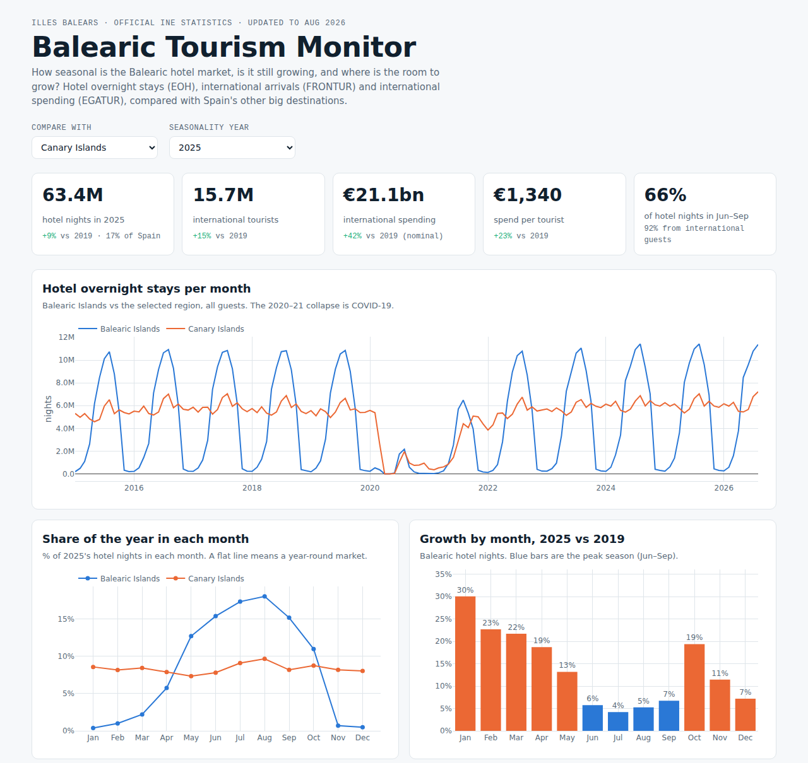
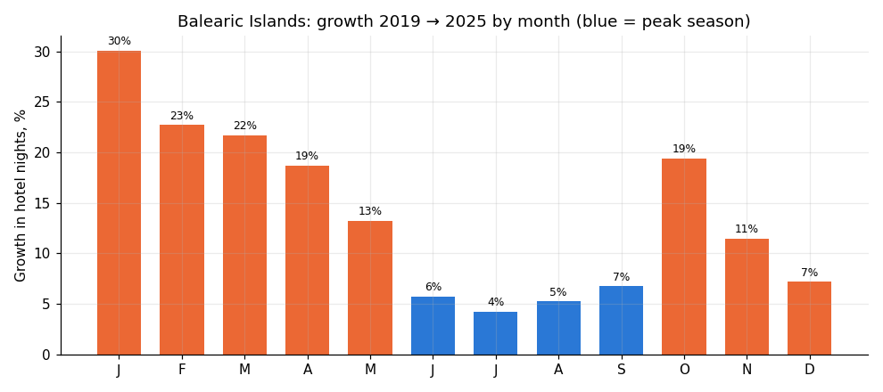

# 🏝️ Balearic Islands Tourism — Seasonality, Recovery & Spend

> **Two thirds of all Balearic hotel nights happen in just four summer months.** Using official monthly statistics from
> Spain's National Statistics Institute (INE), this project builds a **data pipeline → star schema → SQL analysis →
> interactive dashboard** to answer: *how seasonal is the market, is it still growing, and where is the room to grow?*

**Tools:** Python (pandas, statsmodels) · SQL (DuckDB) · Dimensional modelling · Plotly.js dashboard · Power BI (DAX guide)

**▶ [Live dashboard](https://robertobustamanteperez25-star.github.io/balearic-tourism/)**



---

## 📌 Key results (2025, last complete year)

| Metric | Balearic Islands | Spain |
|---|---|---|
| Hotel overnight stays | **63.4M** (17% of Spain) | 366.1M |
| vs 2019 (pre-pandemic) | **+9.1%** — fastest recovery of the big destinations | +6.7% |
| Share of hotel nights in Jun–Sep | **66%** | 47% |
| International tourists / spend | **15.7M / €21.1bn** | 96.8M / €134.7bn |
| Spend per international tourist | **€1,340** (+23% vs 2019, nominal) | €1,392 |
| Hotel nights from foreign guests | **92%** | 67% |

## 🔎 Main insights

1. **Extreme seasonality.** 66% of hotel nights fall in Jun–Sep and August sells ~48× more nights than January.
   The Canary Islands, with the same tourist volume, are a year-round market (35% in summer).
2. **Growth has moved to the shoulder season.** Since 2019, summer grew ~5% while **April, October and winter grew 19–30%**.
   In 2026 the peak months are already slightly *below* 2025 (Jun −1.5%, Jul −1.7%), a sign of summer saturation.
3. **Value over volume.** International tourists +15% vs 2019, their spending **+42%**.
4. **High dependence on foreign markets:** 92% of hotel nights come from non-residents, who stay 5.3 nights vs 3.5 for Spanish residents.



## 💡 Recommendations
- Focus marketing, events and air connectivity on **April–May and October**, where demand is growing fastest and capacity is free.
- Track success with **value metrics** (spend per tourist, length of stay), not just arrivals.
- Next analysis: break down the 92% international demand by **source country** to measure concentration risk.

## 🧠 Methodology

```
INE CSVs ──▶ etl/build_dataset.py ──▶ star schema (CSV + DuckDB) ──▶ sql/analysis.sql
                                                   │                 notebooks/balearic_tourism.ipynb
                                                   └────────────────▶ dashboard (docs/index.html) · Power BI
```

- **Star schema:** `dim_date`, `dim_region`, `dim_market` + `fact_hotel` (month × region × market) and
  `fact_international` (month × region). Province rows are excluded to avoid double counting.
- **Data quality checks:** domestic + international reconciles with the total (max gap 0.003%); 2026 is partial (to Aug),
  so yearly comparisons use 2019 vs 2025.
- **SQL:** 7 business questions with CTEs, window functions (`FIRST_VALUE`, `LAG`, `QUALIFY`) and `FILTER` aggregates.
- **Forecast, reported honestly:** a Holt-Winters model (MAPE 4.6%) did **not** beat the seasonal-naive baseline
  "same month last year" (MAPE 4.4%) on a 12-month backtest, so the baseline is the recommended forecast.

## 🗂️ Repository structure

```
├── get_data.py                     # downloads the 3 INE tables into data/raw/
├── etl/ine.py, build_dataset.py    # parsing (Spanish number format, INE periods) + star schema
├── data/processed/                 # clean star-schema CSVs (ready for Power BI)
├── sql/analysis.sql                # 7 business questions
├── notebooks/balearic_tourism.ipynb
├── dashboard/                      # template + build script for the interactive dashboard
├── docs/index.html                 # the dashboard, served by GitHub Pages
└── powerbi/POWER_BI_GUIDE.md       # model, relationships and 13 DAX measures
```

## ▶️ How to run

```bash
pip install -r requirements.txt
python get_data.py                    # or download the CSVs manually (links inside the script)
python etl/build_dataset.py
duckdb data/processed/tourism.duckdb < sql/analysis.sql
python dashboard/build_dashboard.py   # regenerates docs/index.html
```

## 📚 Data & limitations
Instituto Nacional de Estadística (INE): EOH table 2074, FRONTUR table 10823, EGATUR table 10839 (monthly, 1999/2015–2026).
Hotels only (holiday rentals excluded), spending in nominal euros (not inflation-adjusted), regional level (no split by island).

---
**Roberto Bustamante Pérez** · Data Science student (UOC) · Palma de Mallorca, Spain ·
[LinkedIn](https://www.linkedin.com/in/roberto-bustamante-perez/) · [GitHub](https://github.com/robertobustamanteperez25-star)
